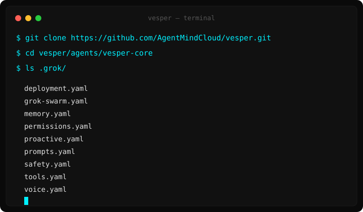
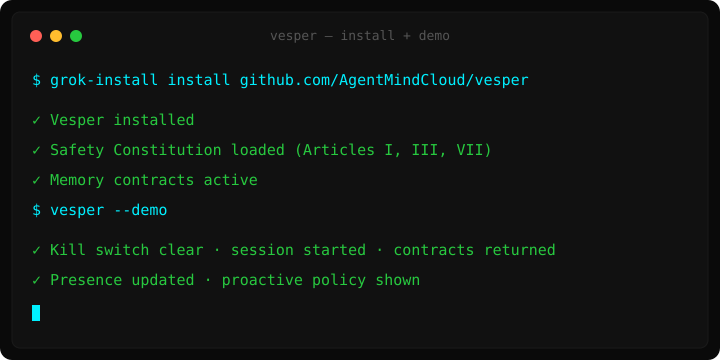

<p align="center">
  
</p>

<h1 align="center">Vesper</h1>

<p align="center">
  <strong>Builder-grade voice presence agent for X</strong><br>
  Governed memory · Live X context · Proactive initiation · Full auditability
</p>

---

## Honest positioning

**Vesper is not a replacement for free Grok Voice on X.**

Free Grok Voice is excellent, requires zero setup, and is better for almost all normal users.

Vesper exists for a different audience:

- Builders who want an agent they can **inspect, extend, and own**
- Power users who want **governed cross-session memory** they control
- People who want **proactive behavior** (the agent can initiate based on mention spikes etc.)
- Anyone who wants the full safety Constitution + kill switches under their own control

If you just want good voice conversations on X, use the free built-in Grok Voice.  
If you want a transparent, composable, memory-contract-based presence agent that lives in *your* environment, Vesper is for you.

---

## What Vesper actually gives you

- **Governed memory contracts** — every memory item has provenance, confidence, scope, retention, and write permissions. You control it.
- **Explicit live X context injection** — designed to pull and use current timeline/mentions as first-class input.
- **Proactive initiation** — can start a session when high-signal events happen (opt-in).
- **3-agent swarm** — Coordinator + Memory-keeper + Visual Presence (transparent, not a black box).
- **Full safety Constitution** (Articles I, III, VII) + kill switch you control.
- **Installable & forkable** — it runs in your environment, not only inside X.

---

## Quick Start

### 1. Clone the repository

```bash
git clone https://github.com/AgentMindCloud/vesper.git
```

This creates a folder called `vesper` in your current directory.

### 2. Enter the project

**Windows (PowerShell):**
```powershell
cd vesper
cd agents\vesper-core
```

**macOS / Linux:**
```bash
cd vesper
cd agents/vesper-core
```

### 3. Check the files

**Windows:**
```powershell
ls .grok\
```

**macOS / Linux:**
```bash
ls .grok/
```

<p align="center">
  
</p>

You should see these files:

- `grok-swarm.yaml`
- `memory.yaml`
- `voice.yaml`
- `safety.yaml`
- `proactive.yaml`
- `tools.yaml`
- `prompts.yaml`
- `permissions.yaml`
- `deployment.yaml`

### 4. Install with grok-install (recommended)

```bash
grok-install install github.com/AgentMindCloud/vesper/agents/vesper-core
```

Or if you already have xlOS:

```bash
xlos install github.com/AgentMindCloud/vesper/agents/vesper-core
```

<p align="center">
  
</p>

### 5. Configure secrets

Create a `.env` file in the `agents/vesper-core` folder with at least:

```
XAI_API_KEY=your_key_here
X_BEARER_TOKEN=your_token_here
GROK_VOICE_API_KEY=your_voice_key_here
```

### 6. Run (when the runtime is available)

```bash
grok-install run
# or
xlos run vesper
```

> **Note:** Full end-to-end voice runtime still depends on the Grok multi-agent + voice endpoints being available in your environment. The YAML + Python stubs are ready; the live loop is what the runtime provides.

---

## Architecture

```
User voice / X event / Proactive trigger
                ↓
┌───────────────────────────┐
│  Coordinator Agent        │  ← real-time + live X context injection
│  (grok-4.20-multi-agent)  │
└──────────┬────────────────┘
           │
     ┌─────┴─────┐
     ↓           ↓
Memory Keeper   Visual Presence
(governed)      (Imagine avatar)
     ↓
Governed Memory Store + Proactive Policy
```

---

## Safety

- Profile: `standard` (real-time voice) + full Constitution (Articles I, III, VII)
- Kill switch: `VESPER_DISABLED=1`
- Memory is encrypted at rest. Cross-session memory is opt-in only.
- Every external write still requires human approval.

---

## Status

**Core is complete.**  
See [STATUS.md](STATUS.md) for the full checklist of what has been implemented.

Built by AgentMindCloud · Independent community project.  
Not affiliated with xAI, Grok, or X.

---

**Vesper** — for builders who want presence they can own and audit.
