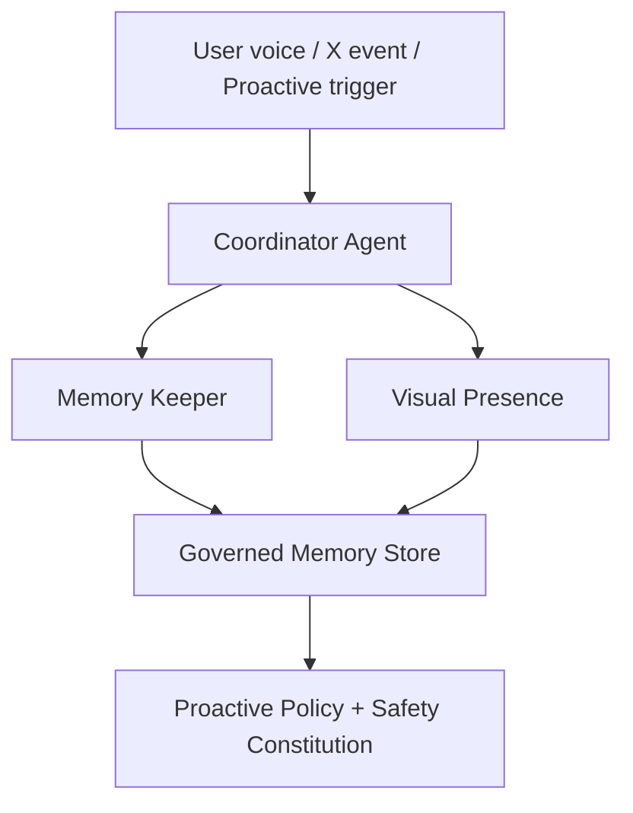
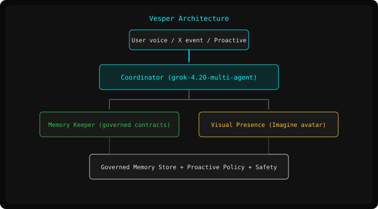
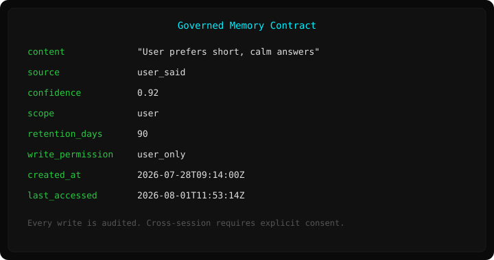

<p align="center">
  
</p>

<h1 align="center">Vesper</h1>

<p align="center">
  <strong>Builder-grade voice presence agent for X</strong><br>
  Governed memory · Live X context · Proactive initiation · Full auditability
</p>

<p align="center">
  
  
  
  
</p>

---

## Honest positioning

**Vesper is not a replacement for free Grok Voice on X.**

Free Grok Voice is excellent, requires zero setup, and is better for almost all normal users.

Vesper exists for a different audience:

- Builders who want an agent they can **inspect, extend, and own**
- Power users who want **governed cross-session memory** they control
- People who want **proactive behavior** (the agent can initiate based on mention spikes etc.)
- Anyone who wants the full safety Constitution + kill switches under their own control

If you just want good voice conversations on X, use the free built-in Grok Voice.  
If you want a transparent, composable, memory-contract-based presence agent that lives in *your* environment, Vesper is for you.

---

## What Vesper actually gives you

| Capability | Detail |
|------------|--------|
| **Governed memory contracts** | Every memory item has provenance, confidence, scope, retention, and write permissions. You control it. |
| **Explicit live X context** | Designed to pull and use current timeline/mentions as first-class input. |
| **Proactive initiation** | Can start a session when high-signal events happen (opt-in, rate-limited). |
| **3-agent swarm** | Coordinator + Memory-keeper + Visual Presence (transparent, not a black box). |
| **Full safety Constitution** | Articles I, III, VII + kill switch you control (`VESPER_DISABLED=1`). |
| **Installable & forkable** | Runs in your environment, not only inside X. |

---

## Quick Start (friction-free)

### Option A — One-command with grok-install / xlOS (recommended)

```bash
grok-install install github.com/AgentMindCloud/vesper
# or
xlos install github.com/AgentMindCloud/vesper
```

### Option B — Local demo (zero keys, works offline right now)

```bash
git clone https://github.com/AgentMindCloud/vesper.git
cd vesper
pip install -e ".[dev]"
vesper --demo
# or
python -m vesper.runtime --demo
```

You will see the full flow: kill-switch check → session start → memory contracts returned → presence update → proactive policy summary.

<p align="center">
  
</p>

### Option C — Live configuration

1. Copy the example env file:

```bash
cp .env.example .env
```

2. Fill real values (see comments in the file):

```
XAI_API_KEY=...          # from console.x.ai
X_BEARER_TOKEN=...       # from developer.x.com → App → Keys and tokens
GROK_VOICE_API_KEY=...   # same as XAI_API_KEY
```

3. Validate:

```bash
vesper --check-env
```

4. Run via the installed runtime:

```bash
grok-install run
# or
xlos run vesper
```

> **Note:** Full end-to-end voice still depends on Grok multi-agent + voice endpoints being available in your environment. The YAML contracts + Python entrypoints + local demo + memory store are ready today.

---

## Architecture



<p align="center">
  
</p>

All configuration lives in `.grok/` (swarm, memory contracts, voice latency budgets, safety, proactive triggers, tools, prompts, permissions, deployment).

---

## Governed Memory Contracts

Every fact is a validated contract:

<p align="center">
  
</p>

- Cross-session memory is **off by default** and requires explicit user consent.
- Every write / query / revoke is audited.
- See `examples/sample_memory_contracts.json` for ready-to-load examples.

---

## Safety & Control

- Profile: `standard` (real-time voice) + full Constitution (Articles I, III, VII)
- Kill switch: `VESPER_DISABLED=1` → immediate halt of all activity
- Memory is designed for encryption at rest. Cross-session memory is **opt-in only**.
- Every external write still requires human approval.
- Network allowlist + rate limits + audit logging.

---

## Project layout

```
vesper/
├── .grok/                 # All agent contracts (inspectable)
├── src/vesper/            # Runtime + memory store
├── examples/              # Sample memory contracts
├── tests/                 # Unit tests
├── docs/                  # Logo + visual instructions
├── .env.example           # Secrets template
├── grok-install.yaml      # Install manifest
├── pyproject.toml         # Packaging + CLI
├── LICENSE                # Apache-2.0
└── README.md
```

---

## Development

```bash
pip install -e ".[dev]"
pytest -q
vesper --demo
```

---

## Status

**Core + memory store + tests are complete.**  
See [STATUS.md](STATUS.md) for the full checklist.

Built by AgentMindCloud · Independent community project.  
Not affiliated with xAI, Grok, or X.

---

**Vesper** — for builders who want presence they can own and audit.
